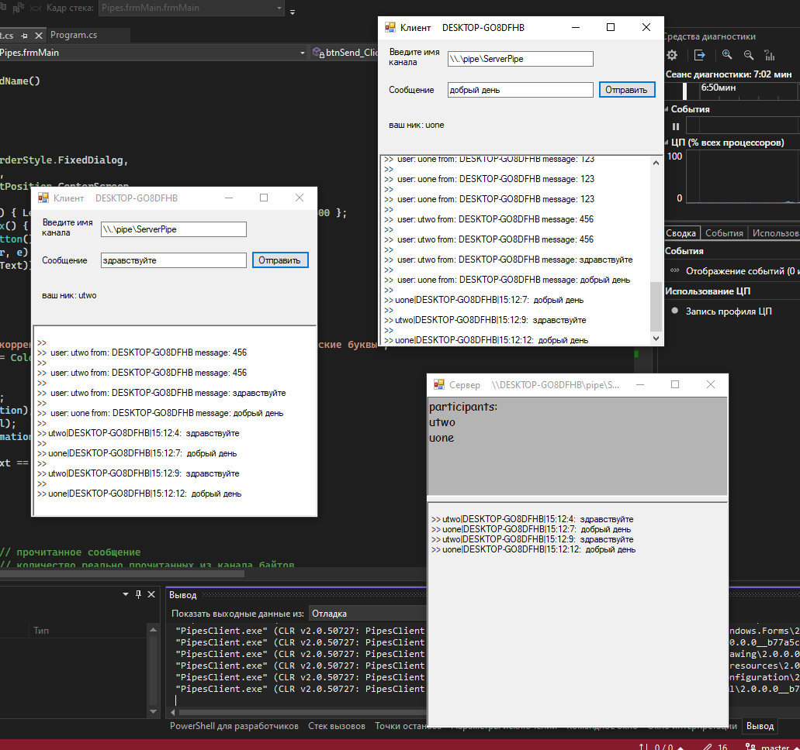

# лабораторная работа по предмету теория и алгоритмы высокопроизводительных вычислений № 1

# задание
см. [./task.md](./task.md)

# решение

1. поведение при нескольких серверах
сервера читают из очереди попеременно. это происходит из-за следующего:
a, b, c - сервер 1, сервер 2, сервер 3
a() lock at 0s 
b() lock at 2s
c() lock at 5s

send message 
a - got message, lock at 6s
b - lock at 2s
c - lock at 5s

send message
a - got message, lock at 6s
b - got message, lock at 9s
c - lock at 5s

send message
a - got message, lock at 6s
b - got message, lock at 9s
c - got message, lock at 15s

send message
a - got message, lock at 20s
b - got message, lock at 9s
c - got message, lock at 15s

то есть:
рид из пайпа блокирует процесс. т.к. процессы не запускаются одновременно они блокируются в порядке запуска и встают в системный шедулер.
шедулер шедулит процесс который ждал больше всего, самый ранний.

2. Чат реализован так:
    - каждый клиент сначала запрашивает свой никнейм таким образом чтобы его можно было использовать как имя пайпа. затем клиент открывает 2 пайпа: к серверу на запись и именованный на чтение сообщений. при посылке сообщения клиент разделяет спецсимволом отправителя, днс имя и сообщение. сервер добавляет отправителя в participants если еще не, образует имя пайпа из полученных данных и в конце отправляет на все пайпы сообщение.
    - фичи:
        - participants отображаются комик сансом
        - возможно послать личное сообщение если указать в пайпе его имя и днс

