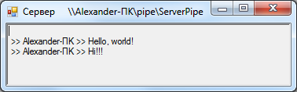
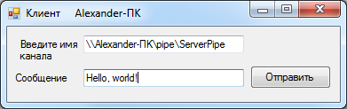

***Практическое задание № 1. Именованные каналы (Named Pipes)***

**Теория**

*Материал составлен на основе ресурса: Шевченко И. Что такое Named Pipes
и как с ними бороться. \[Электронный ресурс\]. URL:
http://www.delphimaster.ru/articles/named_pipes (дата обращения:
15.01.2014).*

Каналы (Pipes) -- это объекты ядра операционной системы, являющиеся
средством межпроцессной коммуникации между сервером канала и одним или
несколькими клиентами канала в локальной сети.

Сервером канала называется процесс, создающий канал. Клиентом канала
называется процесс, подключающийся к созданному каналу.

Существуют две разновидности каналов: именованные (Named Pipes) и
неименованные (анонимные -- Anonymous Pipes).

*Именованным каналам* при создании присваивается имя, которое доступно
для других процессов -- зная имя, процесс может подключиться к каналу.

*Неименованные каналы* используются обычно для передачи данных между
родительскими и дочерними процессами.

В общем случае имена каналов записываются в виде

\\\\ИмяСервера\\pipe\\ИмяКанала

ИмяСервера -- имя компьютера в домене или IP-адрес компьютера. Если
процесс создает или открывает канал на локальном компьютере, вместо
имени сервера можно указать символ '.' (точка):

\\\\.\\pipe\\ИмяКанала

(процесс может создать канал только на том компьютере, на котором он
выполняется, поэтому имя сервера указывать не обязательно). При открытии
процессом канала, созданного на другом компьютере, имя сервера указывать
необходимо.

При создании именованного канала ему назначается уникальное имя,
определяется максимальное количество одновременных соединений с
клиентами канала и режим работы канала (должен ли канал быть
односторонним или двусторонним (дуплексным), ведется ли передача
пакетами или потоком байтов. При передаче пакетами данные одной операции
записи отделяются в буфере канала от данных другой операции записи).

Базовым объектом для реализации каналов служит объект «файл», поэтому
для посылки и приема сообщений по каналам используются те же самые
функции Windows API, что и при работы с файлами (CreateFile, ReadFile,
WriteFile).

Для каждого процесса-клиента канала создается свой экземпляр канала, с
собственными буферами и дескрипторами/описателями (handles) и с
собственным механизмом передачи данных, не влияющим на остальные
экземпляры.

Каналы, также как и файлы, наследуют стандартную защиту объектов
Windows, что позволяет разграничить участников коммуникации и обеспечить
запрет несанкционированного доступа к каналу.

Создание каналов возможно только в NT-системах, подключение к созданному
каналу возможно как в NT-системах, так и в Win9x. Кроме того, API работы
с каналами в Win9x не поддерживает асинхронных операций ввода/вывода.

Каналы широко используются внутри самой системы. Например,
взаимодействие менеджера сервисов с самими сервисами осуществляется
через несколько каналов. Для связи с сервисами RunAs, с планировщиком
событий и с сервером локальной аутентификации также используются каналы.

Каналы являются наиболее простым способом организации связи между
сервисами и пользовательскими приложениями, нуждающимися в такой связи.

Одним из полезных (и довольно уникальных) свойств канала является
возможность сервера заменять права своей учетной записи правами учетной
записи клиента, соединившегося с каналом. Эта возможность служит
преимущественно для ограничения прав сервера при выполнении операций
доступа к различным объектам системы.

**Функции для работы с именованными каналами**

1\. Для создания сервером именованного канала используется следующая
функция:

int **CreateNamedPipe**(string **lpName**, // строка, содержащая имя
канала

int **dwOpenMode**, // режим открытия канала

int **dwPipeMode**, // режим работы канала

int **nMaxInstances**, // максимальное количество реализаций канала

int **nOutBufferSize**, // размер выходного буфера в байтах

int **nInBufferSize**, // размер входного буфера в байтах

int **nDefaultTimeOut**, // время ожидания в мс

int **lpSecurityAttributes**); // адрес структуры защиты

Возвращаемое значение -- идентификатор дескриптора (описателя)
именованного канала.

2\. Ожидание сервером подключения клиента к экземпляру именованного
канала выполняется с помощью функции:

bool **ConnectNamedPipe**(int **hNamedPipe**, // дескриптор канала

int **lpOverlapped**); // адрес структуры OVERLAPPED

Возвращаемое функцией значение -- результат ее выполнения
(успешно/неуспешно).

3\. Отключение серверного процесса от клиентского канала производится с
помощью функции:

bool **DisconnectNamedPipe**(int **hNamedPipe** // дескриптор канала);

Возвращаемое функцией значение -- результат ее выполнения.

4\. Для создания канала клиентским процессом может быть использована
функция CreateFile. С ее помощью можно открыть канал, если вместо имени
файла указать имя канала. Функция возвращает дескриптор канала и имеет
следующий интерфейс:

int **CreateFile**(string **lpFileName**, // строка с именем канала

int **dwDesiredAccess**, // режим доступа

int **dwShareMode**, // режим совместного использования

int **lpSecurityAttributes**, // дескриптор защиты

int **dwCreationDisposition**, // параметры создания

int **dwFlagsAndAttributes**, // атрибуты файла

int **hTemplateFile**); // идентификатор файла с атрибутами

5\. Запись данных в канал выполняется с помощью функции WriteFile,
которая имеет следующий интерфейс:

bool **WriteFile**(int **hNamedPipe**, // дескриптор канала

byte\[\] **lpBuffer**, // адрес буфера, данные из которого будут
записаны в канал

uint **nNumberOfBytesToWrite**, // размер буфера

ref uint **lpNumberOfBytesWritten**, // число байт, действительно
записанных в канал

int **lpOverlapped**); // адрес структуры OVERLAPPED

Возвращаемое функцией значение -- результат ее выполнения.

6\. Чтение данных из канала выполняется с помощью функции со следующим
интерфейсом:

bool **ReadFile**(int **hNamedPipe**, // дескриптор канала

byte\[\] **lpBuffer**, // адрес буфера, в который будут прочитаны данные
из канала

uint **nNumberOfBytesToRead**, // размер буфера

ref uint **lpNumberOfBytesRead**, // количество действительно
прочитанных байт из канала

int **lpOverlapped**); // адрес структуры OVERLAPPED

Возвращаемое функцией значение -- результат ее выполнения.

7\. Функция, которая позволяет «принудительно» записать данные,
расположенные в буфере операционной системы, в файл, имеет следующий
вид:

bool **FlushFileBuffers**(int **hNamedPipe** // дескриптор канала);

Возвращаемое функцией значение -- результат ее выполнения.

8\. Закрытие дескриптора можно выполнить с помощью следующей функции:

bool **CloseHandle**(int **hNamedPipe** // дескриптор канала);

**Алгоритм обмена сообщениями с помощью именованных каналов**

Обмен сообщениями с использованием именованных каналов выполняется по
следующему алгоритму:

> 1\. Сервер создает именованный канал с помощью функции
> CreateNamedPipe.
>
> 2\. Сервер приступает к «прослушиванию» именованного канала с помощью
> функции ConnectNamedPipe.
>
> 3\. Клиент подключается к каналу сервера с помощью функции CreateFile.
>
> 4\. Клиент записывает сообщения в канал сервера с помощью функции
> WriteFile.
>
> 5\. Сервер «принудительно» записывает данные, расположенные в буфере
> операционной системы, в файл именованного канала с помощью функции
> FlushFileBuffers и считывает данные из канала с помощью функции
> ReadFile.
>
> 6\. Пока у клиента есть сообщения, выполняется последовательность
> шагов 4-5. Иначе выполняется переход к шагу 7.
>
> 7\. Клиент отключается от именованного канала сервера с помощью
> функции CloseHandle.
>
> 8\. Сервер отключается от канала клиента с помощью функции
> DisconnectNamedPipe. И приступает к ожиданию следующего клиента
> (выполняет переход к шагу 2). Если клиенты на обслуживание
> отсутствуют, то сервер переходит к шагу 9.
>
> 9\. Сервер закрывает дескриптор канала с помощью функции CloseHandle.

**Разработка приложения «Чат v 1.0»**

Разработаем приложение, которое позволяет с помощью именованных каналов
отправлять серверу сообщения сразу от нескольких клиентов, необязательно
расположенных на одном узле сети. Сервер представляет собой форму, на
которой отображаются все полученные им сообщения (см. рис. 1).

***Рис. 1. Окно сервера при коммуникации с помощью именованных
каналов***

Клиент представляет собой форму, содержащую два поля ввода и кнопку (см.
рис. 2).

***Рис. 2. Окно клиента при коммуникации с помощью именованных
каналов***

Первое поле предназначено для ввода имени именованного канала в формате
указанном выше. Второе поле предназначено для ввода сообщения для
отправки. При нажатии на кнопку «Отправить» сообщение, в котором указано
имя компьютера клиента (для его идентификации) и текст сообщения,
введенный пользователем, будет отправлено серверу.

Код реализации сервера с комментариями приведен ниже:

+-----------------------------------------------------------------------+
| public partial class frmMain : Form                                   |
|                                                                       |
| {                                                                     |
|                                                                       |
| private Int32 PipeHandle; // дескриптор канала                        |
|                                                                       |
| private string PipeName = \"\\\\\\\\\" + Dns.GetHostName() +          |
| \"\\\\pipe\\\\ServerPipe\"; // имя канала, Dns.GetHostName() - метод, |
| возвращающий имя машины, на которой запущено приложение               |
|                                                                       |
| private Thread t; // поток для обслуживания канала                    |
|                                                                       |
| private bool \_continue = true; // флаг, указывающий продолжается ли  |
| работа с каналом                                                      |
|                                                                       |
| // конструктор формы                                                  |
|                                                                       |
| public frmMain()                                                      |
|                                                                       |
| {                                                                     |
|                                                                       |
| InitializeComponent();                                                |
|                                                                       |
| // создание именованного канала                                       |
|                                                                       |
| PipeHandle =                                                          |
| DIS.Import.CreateNamedPipe(\"\\\\\\\\.\\\\pipe\\\\ServerPipe\",       |
| DIS.Types.PIPE_ACCESS_DUPLEX, DIS.Types.PIPE_TYPE_BYTE \|             |
| DIS.Types.PIPE_WAIT, DIS.Types.PIPE_UNLIMITED_INSTANCES, 0, 1024,     |
| DIS.Types.NMPWAIT_WAIT_FOREVER, (uint)0);                             |
|                                                                       |
| // вывод имени канала в заголовок формы, чтобы можно было его         |
| использовать для ввода имени в форме клиента, запущенного на другом   |
| вычислительном узле                                                   |
|                                                                       |
| this.Text += \" \" + PipeName;                                        |
|                                                                       |
| // создание потока, отвечающего за работу с каналом                   |
|                                                                       |
| t = new Thread(ReceiveMessage);                                       |
|                                                                       |
| t.Start();                                                            |
|                                                                       |
| }                                                                     |
|                                                                       |
| private void ReceiveMessage()                                         |
|                                                                       |
| {                                                                     |
|                                                                       |
| string msg = \"\"; // прочитанное сообщение                           |
|                                                                       |
| uint realBytesReaded = 0; // количество реально прочитанных из канала |
| байтов                                                                |
|                                                                       |
| // входим в бесконечный цикл работы с каналом                         |
|                                                                       |
| while (\_continue)                                                    |
|                                                                       |
| {                                                                     |
|                                                                       |
| if (DIS.Import.ConnectNamedPipe(PipeHandle, 0))                       |
|                                                                       |
| {                                                                     |
|                                                                       |
| byte\[\] buff = new byte\[1024\]; // буфер прочитанных из канала      |
| байтов                                                                |
|                                                                       |
| DIS.Import.FlushFileBuffers(PipeHandle); // \"принудительная\" запись |
| данных, расположенные в буфере операционной системы, в файл           |
| именованного канала                                                   |
|                                                                       |
| DIS.Import.ReadFile(PipeHandle, buff, 1024, ref realBytesReaded, 0);  |
| // считываем последовательность байтов из канала в буфер buff         |
|                                                                       |
| msg = Encoding.Unicode.GetString(buff); // выполняем преобразование   |
| байтов в последовательность символов                                  |
|                                                                       |
| rtbMessages.Invoke((MethodInvoker)delegate                            |
|                                                                       |
| {                                                                     |
|                                                                       |
| if (msg != \"\")                                                      |
|                                                                       |
| rtbMessages.Text += \"\\n \>\> \" + msg; // выводим полученное        |
| сообщение на форму                                                    |
|                                                                       |
| });                                                                   |
|                                                                       |
| DIS.Import.DisconnectNamedPipe(PipeHandle); // отключаемся от канала  |
| клиента                                                               |
|                                                                       |
| Thread.Sleep(500); // приостанавливаем работу потока перед тем, как   |
| приступить к обслуживанию очередного клиента                          |
|                                                                       |
| }                                                                     |
|                                                                       |
| }                                                                     |
|                                                                       |
| }                                                                     |
|                                                                       |
| private void frmMain_FormClosing(object sender, FormClosingEventArgs  |
| e)                                                                    |
|                                                                       |
| {                                                                     |
|                                                                       |
| \_continue = false; // сообщаем, что работа с каналом завершена       |
|                                                                       |
| if (t != null)                                                        |
|                                                                       |
| t.Abort(); // завершаем поток                                         |
|                                                                       |
| if (PipeHandle != -1)                                                 |
|                                                                       |
| DIS.Import.CloseHandle(PipeHandle); // закрываем дескриптор канала    |
|                                                                       |
| }                                                                     |
|                                                                       |
| }                                                                     |
+=======================================================================+
+-----------------------------------------------------------------------+

Код реализации клиента с комментариями приведен ниже:

+-----------------------------------------------------------------------+
| public partial class frmMain : Form                                   |
|                                                                       |
| {                                                                     |
|                                                                       |
| private Int32 PipeHandle; // дескриптор канала                        |
|                                                                       |
| // конструктор формы                                                  |
|                                                                       |
| public frmMain()                                                      |
|                                                                       |
| {                                                                     |
|                                                                       |
| InitializeComponent();                                                |
|                                                                       |
| this.Text += \" \" + Dns.GetHostName(); // выводим имя текущей машины |
| в заголовок формы                                                     |
|                                                                       |
| }                                                                     |
|                                                                       |
| private void btnSend_Click(object sender, EventArgs e)                |
|                                                                       |
| {                                                                     |
|                                                                       |
| uint BytesWritten = 0; // количество реально записанных в канал байт  |
|                                                                       |
| byte\[\] buff =                                                       |
| Encoding.Unicode.GetBytes(Dns.GetHostName().ToString() + \" \>\> \" + |
| tbMessage.Text); // выполняем преобразование сообщения (вместе с      |
| идентификатором машины) в последовательность байт                     |
|                                                                       |
| // открываем именованный канал, имя которого указано в поле tbPipe    |
|                                                                       |
| PipeHandle = DIS.Import.CreateFile(tbPipe.Text,                       |
| DIS.Types.EFileAccess.GenericWrite, DIS.Types.EFileShare.Read, 0,     |
| DIS.Types.ECreationDisposition.OpenExisting, 0, 0);                   |
|                                                                       |
| DIS.Import.WriteFile(PipeHandle, buff, Convert.ToUInt32(buff.Length), |
| ref BytesWritten, 0); // выполняем запись последовательности байт в   |
| канал                                                                 |
|                                                                       |
| DIS.Import.CloseHandle(PipeHandle); // закрываем дескриптор канала    |
|                                                                       |
| }                                                                     |
|                                                                       |
| }                                                                     |
+=======================================================================+
+-----------------------------------------------------------------------+

**Задание**

1\. Изучите разработанное приложение. Запустите исполняемый файл сервера
и клиента на одной машине, затем перенесите один из компонентов
распределенного приложения на другой вычислительный узел (лучше на
ноутбук, т.к. администратор ЛВС вуза может запретить обмен сообщения
между различными узлами ЛВС) и попробуйте его запустить. Запустите
несколько клиентов и попробуйте отправить сообщения одному серверу.

2\. Запустите несколько серверов на одной машине. Отправьте им сообщения
от нескольких клиентов. Объясните, почему приложение перестало работать.

3\. Модифицируйте приложение так, чтобы существовала возможность на
сервере идентифицировать клиентов не по имени вычислительного узла, а по
нику/логину пользователя.

4\. Модифицируйте приложение так, чтобы получился полноценный чат.
Клиент может отправлять сообщения всем клиентам, участвующим в беседе.
Для этого каждый клиент должен иметь возможность просмотра всех
сообщений от всех клиентов, а сервер должен содержать список клиентов,
которые хотят участвовать в беседе, чтобы каждый раз выполнять им
рассылку сообщений.
